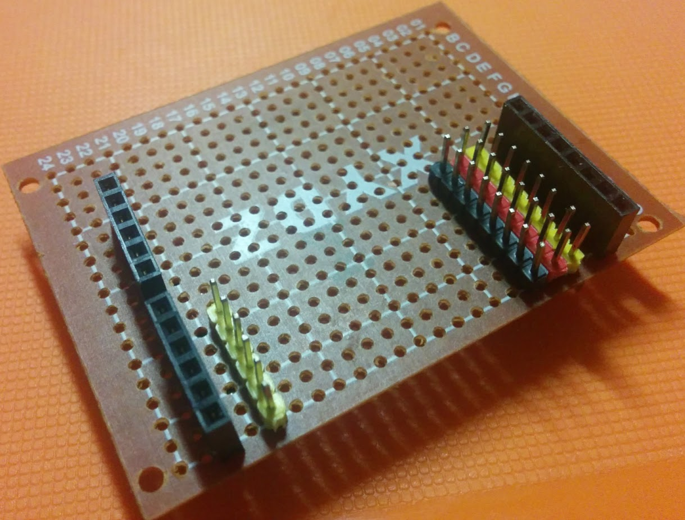
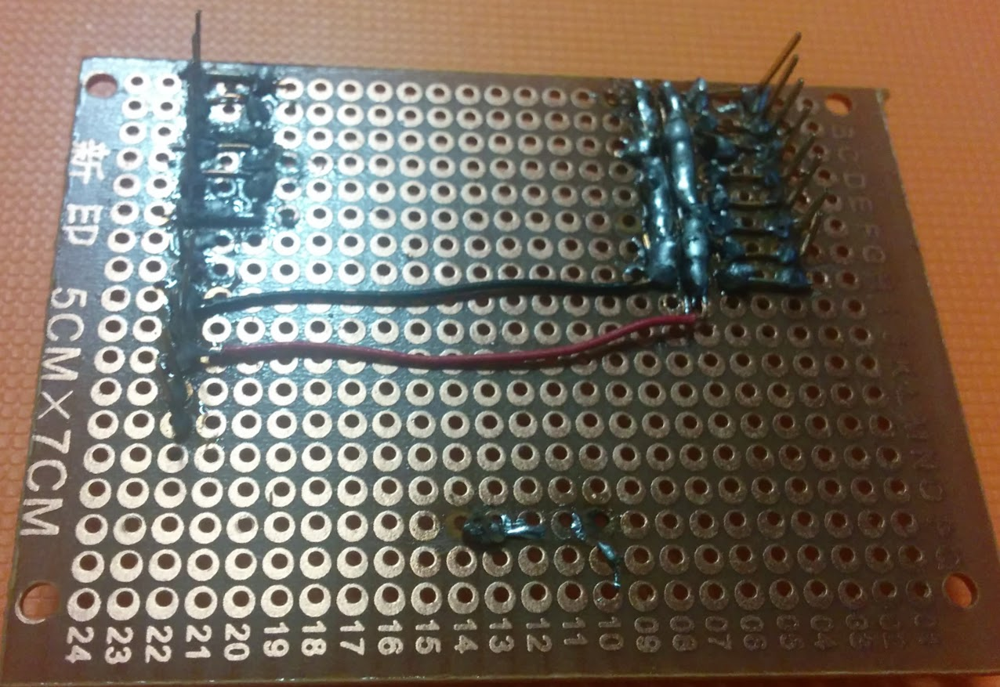

# Shield3Pins

Se trata de diseñar un Shield básico que permite conectar cables de 3 pines, similares a los que tiene la Freaduino o la Bq Zum

Cada vez existen más placas de Arduino que incluyen este tipo de pines

[Iteaduino UNO 6,40$](https://www.itead.cc/iteaduino-uno.html)

[ICStation Atmega328P Uno 9,75$ ](http://www.icstation.com/icstation-atmega328p-board-compatible-arduino-p-3746.html)

[SaintSmart UNO 12$](http://www.sainsmart.com/arduino/control-boards/sainsmart-uno-r3-atmega328-au-development-board-compatible-with-arduino-uno-r3.html)

## Primeras pruebas

## Referencias
[Como crear una protoboard fácilmente con Kicad](http://electronics.stackexchange.com/questions/198934/how-approach-breadboard-layout-using-kicad)

## Ejemplos  de placas de prototipo que nos podrían servir

[Pcb en ebay](http://www.ebay.es/itm/Pre-Drilled-Copper-Prototype-PCB-Stripboard-Printed-Circuit-Board-Board-95x72mm-/231675310864?hash=item35f0ecb310:g:cZYAAOSw~gRV6FPr)

[PCB en aliexpress](https://es.aliexpress.com/store/product/Universal-Breadboard-400-point-MW-201-Solderless-Prototype-Bread-board-PCB-for-arduino-raspberry-pi-2/1270976_32398566022.html)

[Más placas: stripboards](https://es.aliexpress.com/wholesale?SearchText=stripboard)
